# Running on TWCC

## Create Container

1. Visit TWCC (<https://www.twcc.ai>) and click `Sign In`.
   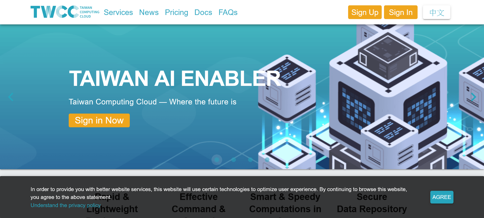
2. Enter your email and password, and then login through iService.
   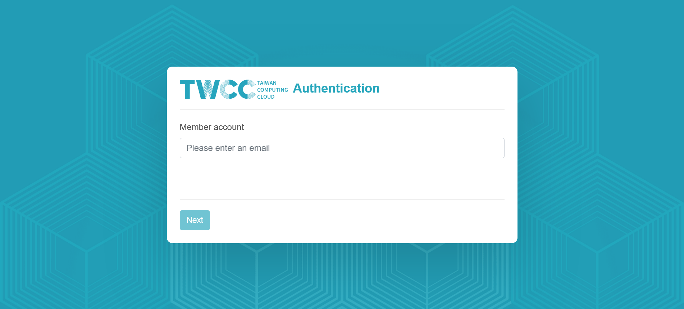
3. You should be re-directed to the user dashboard (<https://www.twcc.ai/user/dashboard>) after sign in.
   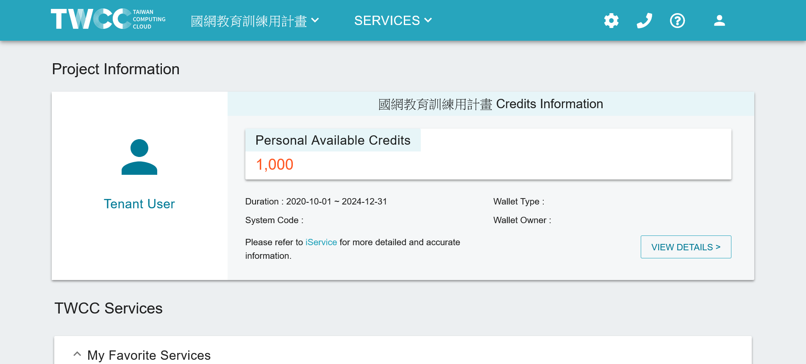
4. Click the top-left dropdown and select the 「國網教育訓練用計畫」 instead of other wallets.  
   **WARNING**: This is an important step to avoid charges on your other wallets.
   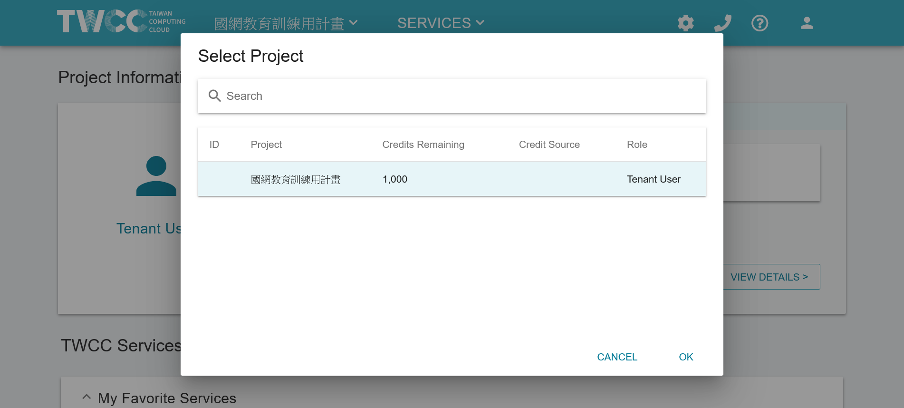
5. Click the second dropdown: `Services > Interactive Container`.
   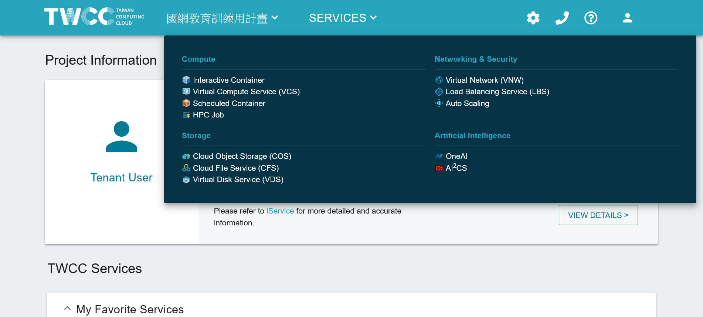
6. And click `Create`.
   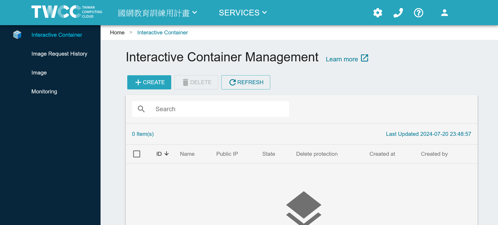
7. Search for `nemo` or `triton` and click it, depending on which tutorial you want to run.
   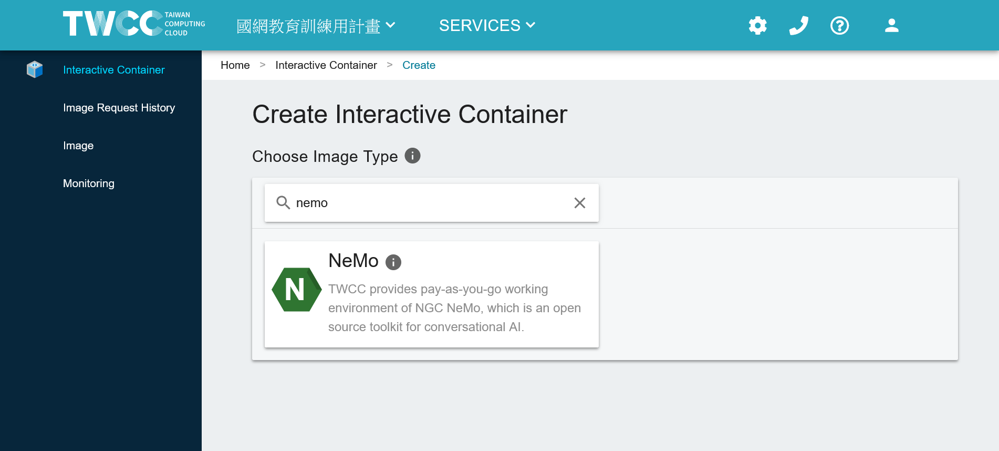
   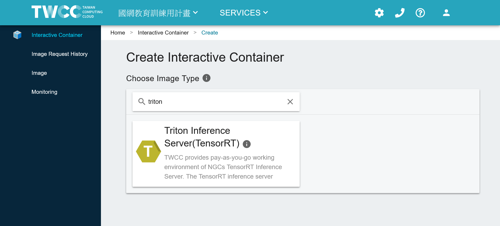
8. Select container image `nemo-24.05:latest` or `tritonserver-24.05-trtllm-python-py3:latest`, depending on which tutorial you want to run, and then scroll down.
   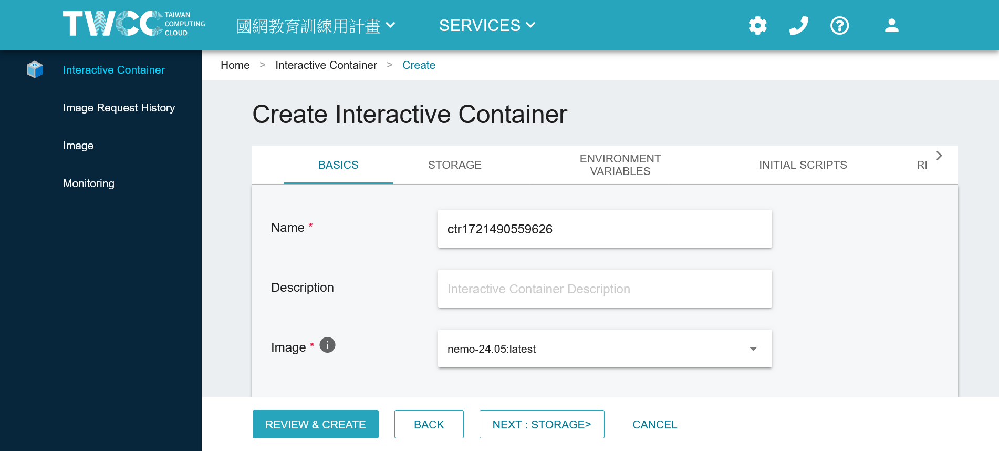
9. Select `c.super` (V100 GPU x1) for the configuration type, and click `REVIEW & CREATE`
   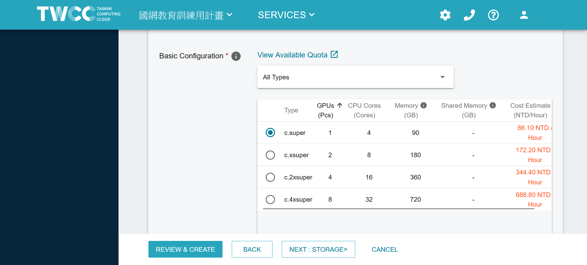
10. Confirm again that you are using the correct wallet 「國網教育訓練用計畫」, and click `CREATE`.
    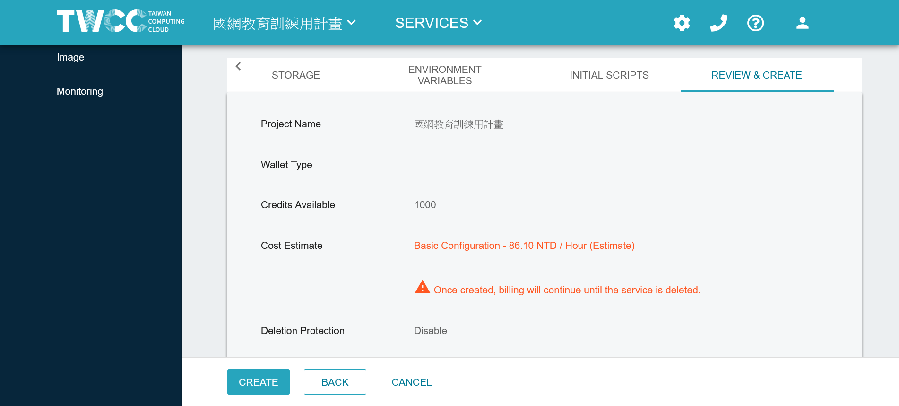
11. Wait for the container to be initialized and ready. You can click `REFRESH` to check the status after a few minutes.  
    **WARNING**: After finishing the tutorial, make sure to check the container and click `DELETE` to avoid using up all your credits.
    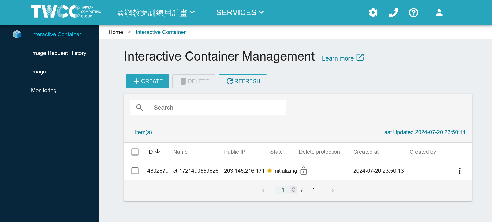
12. When the container shows `Ready`, click the container name to enter the details page.
    
13. Scroll down the container details page.
    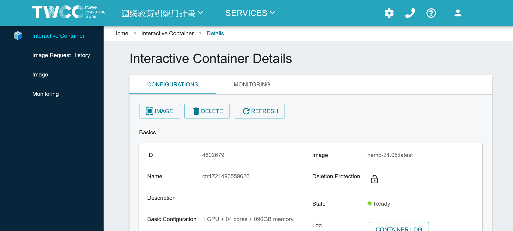
14. Click the `LAUNCH` button in the `Jupyter` row to open the Jupyter Notebook.
    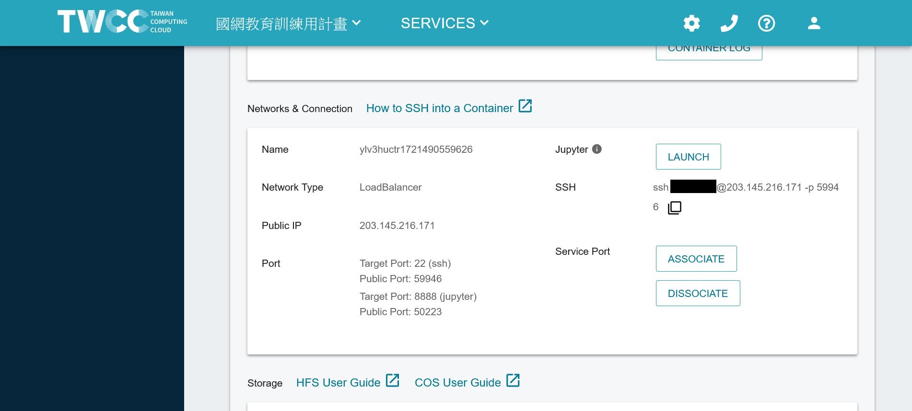
15. Click `New` and then `Terminal` to open a terminal.
    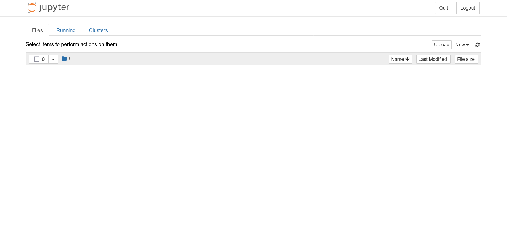
    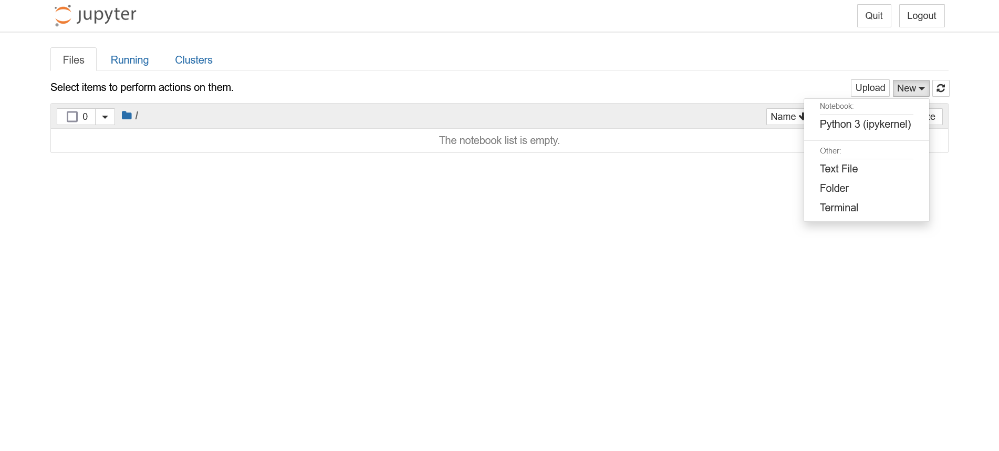
16. You can now run commands in the terminal.
    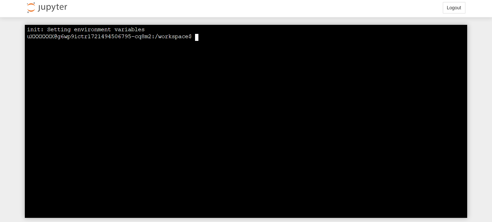

Related video: [TWCC 開發型容器-基本操作](https://youtu.be/LhqBdJK0PrY)

## Environment Setup

In the terminal, run:

```sh
# Clone the repository and link the workspace
cd ~
git clone https://github.com/j3soon/LLM-Tutorial
sudo rm -rf /workspace
sudo ln -s $PWD/LLM-Tutorial/workspace /.
# Change ownership for NeMo 24.05, which is required when patching it later in the notebook
sudo chown -R $(id -u):$(id -g) /opt/NeMo
# All done! Go back to Jupyter Notebook / Jupyter Lab
```

**Note**: To paste text in the jupyter terminal webpage, press `Ctrl+Shift+V`. To copy text, select the text, right-click, and choose `Copy`.

You should now see the `LLM-Tutorial` folder in the Jupyter file browser.

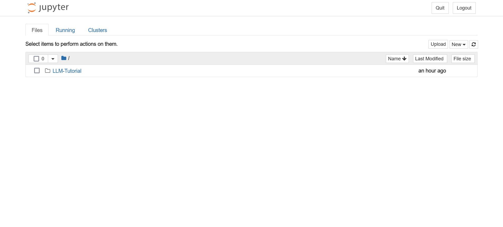

Navigate to `LLM-Tutorial/workspace` and open the notebook you want to run.

## Running the Notebook

Since these notebooks require a lot of time to run, we recommend you to first click `Cell > Run All` to run all cells in the notebook. Then, you can start going through the notebook.

- [NeMo_Training_TinyLlama.ipynb](workspace/NeMo_Training_TinyLlama.ipynb)
- [TensorRT-LLM.ipynb](workspace/TensorRT-LLM.ipynb)
- [NeMo_Guardrails.ipynb](workspace/NeMo_Guardrails.ipynb) (requires a [free NVIDIA NIM API Key](https://build.nvidia.com/mistralai/mixtral-8x22b-instruct))

## Deleting the Container

After you have finished the tutorial, make sure to delete the container to avoid using up all your credits.

The container list should be empty:


## Frequently Asked Questions (FAQ)

### Unexpected Errors During pip Install

If you have been using TWCC in the past, you may encounter unexpected errors during `pip install`. This is because TWCC mounts the user home directory automatically for ease of development. This will cause the package installed by `pip` to be stored under the `~/.local` directory. You can back up the `.local` directory and remove it:

```sh
mv ~/.local ~/.local.bak
```

and then restart the Jupyter kernel.

### Disk Quota Exceeded

This may happen if you are using TWCC in the past and have somehow end up with zero disk quota.

Example error message:

```
~$ git clone https://github.com/j3soon/LLM-Tutorial
Cloning into 'LLM-Tutorial'...
error: copy-fd: write returned: Disk quota exceeded
fatal: cannot copy '/usr/share/git-core/templates/hooks/fsmonitor-watchman.sample' to '/home/uXXXXXXX/LLM-Tutorial/.git/hooks/fsmonitor-watchman.sample': Disk quota exceeded
```

Click `VIEW DETAILS` in the user dashboard and check if the `Total Storage` quota is below `100GiB`. If so, you indeed stumbled upon the disk quota issue. The `HFS Portal` should show similar results.

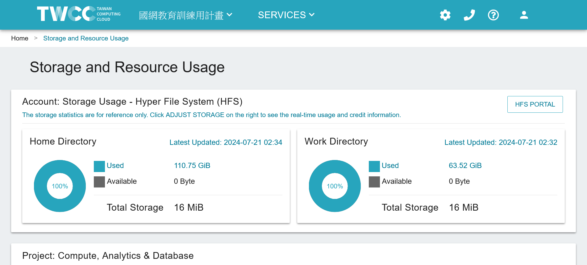
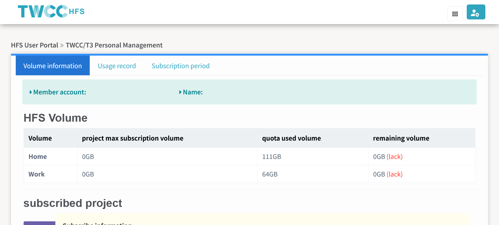

This issue happens rarely and we're currently working with TWCC to resolve it.

### Unexpected Errors During sudo

If you encountered the following error message when running `sudo rm -rf /workspace`:

```
env: ‘rm’: Permission denied
```

This may be due to the `sudo` alias in `~/.bashrc` being added when installing conda. You can remove the alias by commenting the following line in `~/.bashrc`:

```
alias sudo='sudo env PATH=$PA'
```

and then open a new terminal or run `source ~/.bashrc`.
